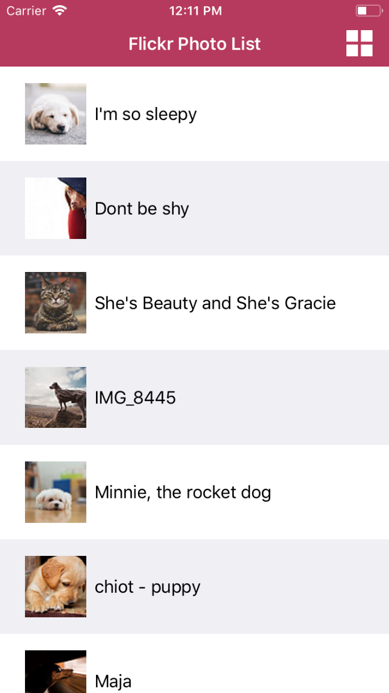
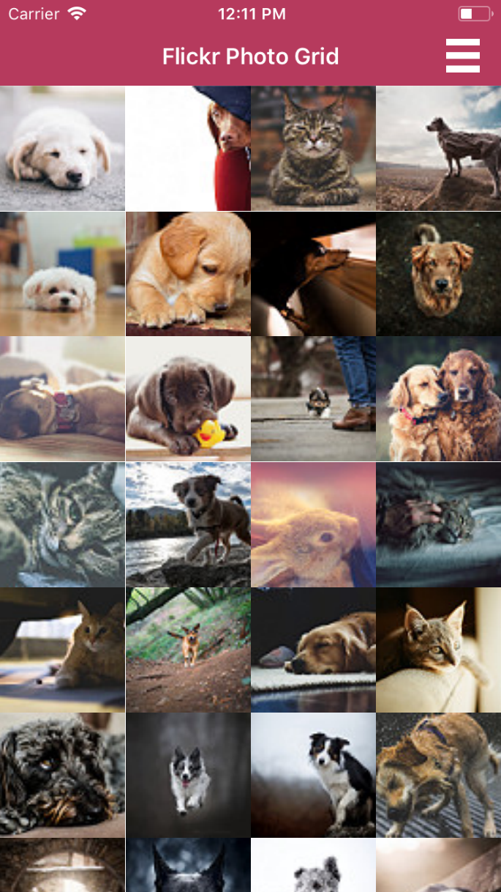

# iOSPhotoViewer
An application to view photos from imgur. You can view the list of photos in a list view or in a grid view. You can also tap on photos to enlarge them.

<b>The List View </b>

The images are displayed in a list using a UITableViewController.

<b>The Grid View </b>

The images are displayed in a grid using a UICollectionViewController.

<b>The Large View </b>

An image is displayed in a new UIViewController. After presenting the view controller, it first diplays the thumbnail image while downloading the original, full-sized image in the background.

